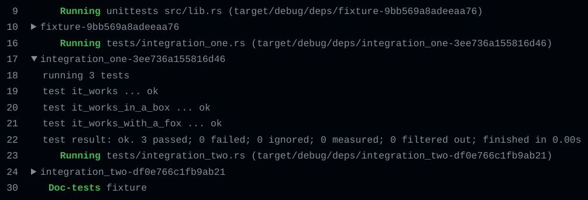

# group-runner

Group Rust executable output in GitHub logs

## Example output



## Recommended usage

1. In your GitHub workflow, install `group-runner`:

   ```yaml
   steps:
     - name: Install group-runner
       run: cargo install group-runner
   ```

2. Pass the following option to `cargo run`, `cargo test`, or `cargo bench`:
   ```sh
   --config "target.'cfg(all())'.runner = 'group-runner'"
   ```
   Example:
   ```yaml
   steps:
     - name: Test
       run: cargo test --config "target.'cfg(all())'.runner = 'group-runner'"
   ```
   See [The Cargo Book] for more information.

## Notes

- To avoid mixing build output with test output, we recommend building the tests in a separate step prior to running them. Example:

  ```yaml
  steps:
    - name: Build
      run: cargo test --no-run
    - name: Test
      run: cargo test --config "target.'cfg(all())'.runner = 'group-runner'"
  ```

[The Cargo Book]: https://doc.rust-lang.org/cargo/reference/config.html#targettriplerunner
